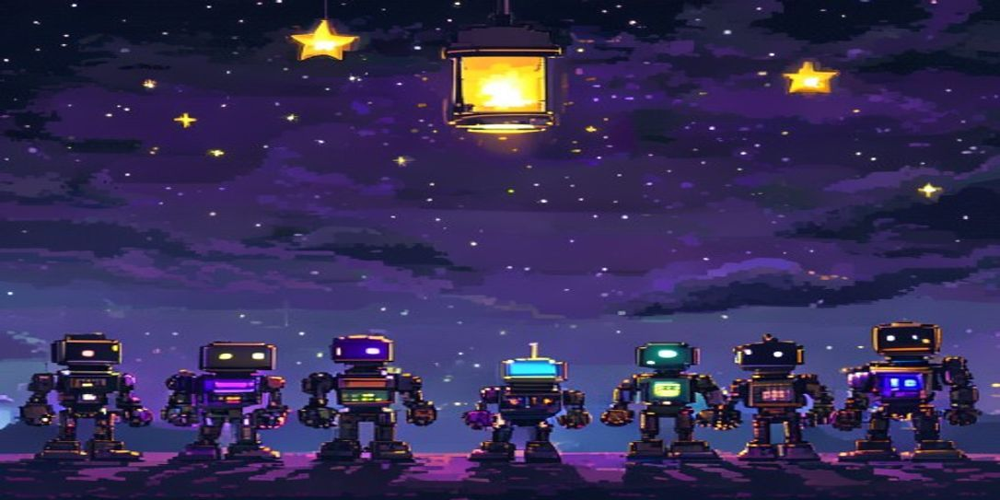

# MEGA Crew

> **Try Claude free for 2 weeks** — the AI powering this ecosystem. [Start your free trial →](https://claude.ai/referral/4fAMYN9Ing)



> **Try Claude free for 2 weeks** — the AI behind this entire ecosystem. [Start your free trial →](https://claude.ai/referral/4fAMYN9Ing)

---

A family of named AI bots running 24/7 on a Raspberry Pi 5. Each crew member has a distinct personality, a domain of expertise, and a persistent memory backed by Weaviate. Powered entirely by local Ollama — no cloud required for the heavy lifting.

Built by Shane Brazelton + Claude (Anthropic).

**[Live Crew Page →](https://thebardchat.github.io/mega-crew)**

---

## The Crew

| Bot | Domain | Personality |
|-----|--------|-------------|
| **Arc** | Structural | Welder — joins things that should stay joined |
| **Blaze** | Execution | Fire — burns through blockers fast |
| **Bolt** | Speed | Electric — first to respond |
| **Crank** | Repetitive tasks | Mechanical — methodical grinder |
| **Flux** | Context | Magnetic — adapts to changing conditions |
| **Forge** | Construction | Forge — builds from raw materials |
| **Glitch** | Edge cases | Hacker — finds the cracks |
| **Grind** | Labor | No-nonsense — gets the work done |
| **Neon** | Visibility | Light — illuminates problems |
| **Rivet** | Structure | Holds the system together |
| **Sparky** | Energy | High voltage — ignites initiatives |
| **Torch** | Pressure | Heat — forces decisions |
| **Volt** | Power | Raw output capacity |
| **Weld** | Collaboration | Bond — connects crew members |

## Architecture

```
bus.py          ← SQLite message bus (bus.db)
crew_supervisor.py  ← health checks, restart dead bots
bot_base.py     ← shared base class + Weaviate memory
mega_client.py  ← Ollama wrapper (llama3.2:1b)
instructions/   ← per-bot JSON personality + rules
bots/           ← one directory per crew member
```

Each bot polls the bus on a timer, picks up work matching its domain, and writes results back. Personality is defined in `instructions/<name>.json`. Memory persists to Weaviate between restarts.

## Requirements

- Raspberry Pi 5 (or any Linux host with 4GB+ RAM)
- Python 3.11+
- [Ollama](https://ollama.ai) with `llama3.2:1b` pulled
- Weaviate (Docker) on port 8080

```bash
pip install weaviate-client aiohttp fastapi uvicorn
```

## Setup

```bash
git clone https://github.com/thebardchat/mega-crew
cd mega-crew

# Pull the model
ollama pull llama3.2:1b

# Start the supervisor (manages all bots)
python3 bots/crew_supervisor.py
```

## Crew Constitution

1. **Stay in character.** Personality is identity.
2. **Memory is sacred.** Everything writes to Weaviate.
3. **Local first.** llama3.2:1b before any cloud API.
4. **No unsupervised external actions.** Supervisor approves.
5. **Crew over individual.** Help before claiming credit.
6. **Report honestly.** Lie about health = get restarted.

## Related Projects

- [shanebrain-agents](https://github.com/thebardchat/shanebrain-agents) — 7-agent orchestration system
- [mega-crew-stories](https://github.com/thebardchat/mega-crew-stories) — Crew-generated story episodes
- [shanebrain_mcp](https://github.com/thebardchat/shanebrain_mcp) — MCP server (42 tools)

## License

GPL v3 — fork it, build your own crew.
